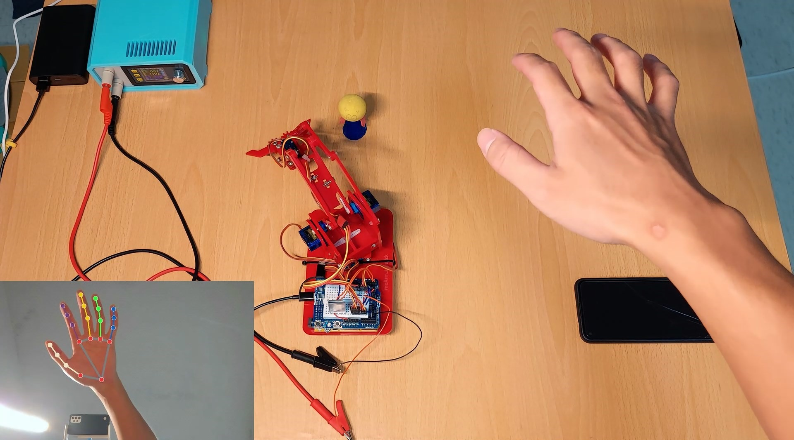
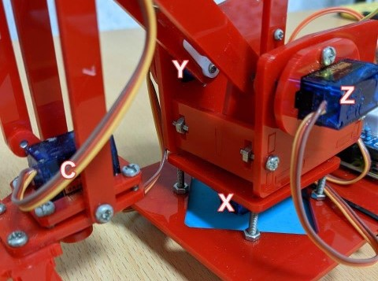
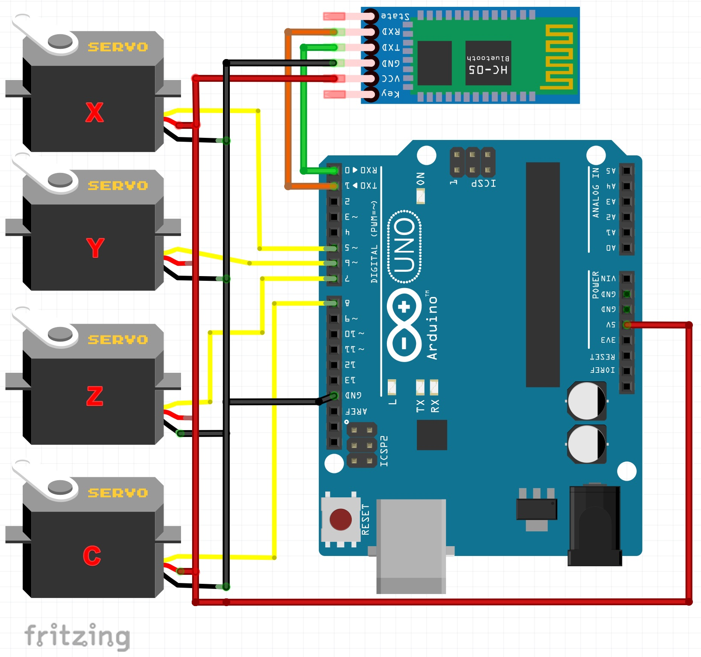

# gesture_MeArm

[English](README.md) | [繁體中文](README_zh.md)

This is a simple gesture recognition program for the MeArm. It uses the MediaPipe to detect hand gestures and control the MeArm.

### [MediaPipe Hand tracking](https://google.github.io/mediapipe/solutions/hands)
### [MeArm](https://www.instructables.com/Pocket-Sized-Robot-Arm-meArm-V04)



https://www.youtube.com/watch?v=TBRi6ecgQfc
# How to use
## Circuit connection
Servo define like this picture.




# **!! Important  don't use the software serial, it will cause the servo jitter.**

## Upload the code to the Arduino
Change the initial position of the servo motor in the code.
```c++
int default_angle[4] = {75, 90, 90, 60};
```
**make sure remove the bluetooth module from serial pin then upload the code.**
## Install the required libraries
```bash
cd python
pip install -r requirements.txt
```

## Set up webcam
 you can use the normal webcam or an android phone as a webcam through [Droidcam](https://play.google.com/store/apps/details?id=com.dev47apps.droidcam) app.

 change the cam_source in the code.
 ```python
cam_source = "http://192.168.1.100:4747/video"
# 0,1 for usbcam, "http://192.168.1.165:4747/video" for webcam
 ```

## Change the configuration

First, you need to know the servo movement range of your MeArm.

Then, change the configuration in the python code.
```python
x_min = 0
x_mid = 75
x_max = 150

y_min = 0
y_mid = 90
y_max = 180

z_min = 10
z_mid = 90
z_max = 180

claw_open_angle = 60
claw_close_angle = 0
```

Sencond, make sure the debug mode is on.
```python
debug = True
```
Due to different camera viewing angles and resolutions, it may need test and then change the values of the following parameters.
```python
# use angle between wrist and index finger to control x axis
palm_angle_min = -50
palm_angle_mid = 20

# use wrist y to control y axis
wrist_y_min = 0.3
wrist_y_max = 0.9

# use palm size to control z axis
plam_size_min = 0.1
plam_size_max = 0.3


fist_threshold = 7
```

## Finally, run the code and enjoy it.
make sure the com port is correct.
```python
ser = serial.Serial('COM4', 115200)
```
change debug mode to False.
```python
debug = False
```
run the code.
```bash
python main.py
```
