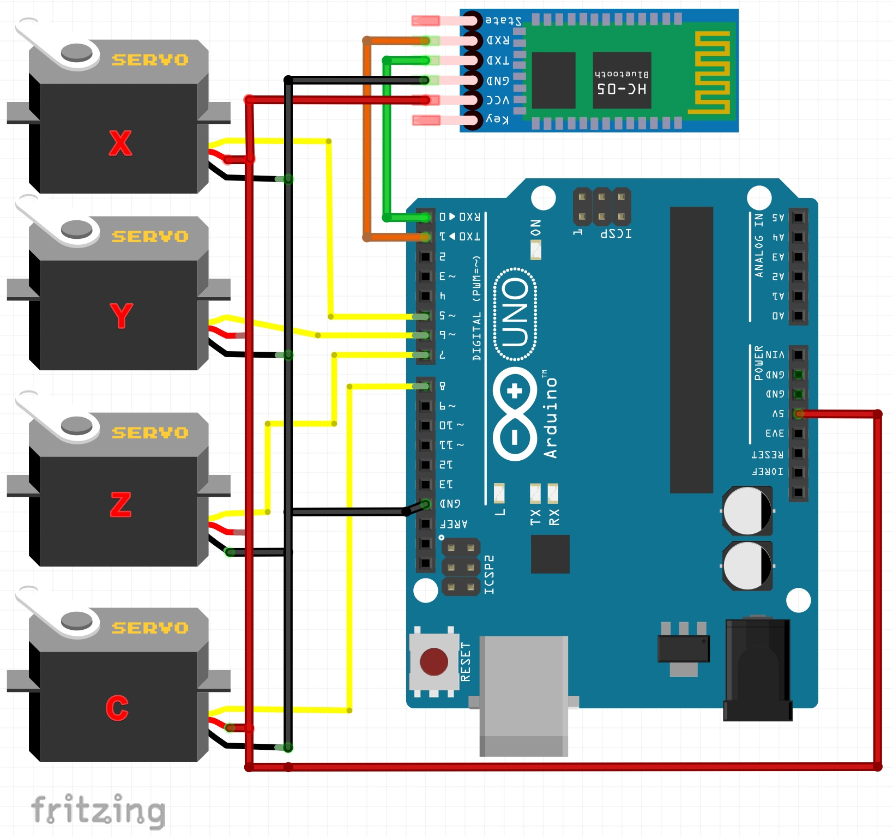

# gesture_MeArm
[English](README.md) | [繁體中文](README_zh.md)

這是一個用於 MeArm 的簡單手勢識別程式。使用 MediaPipe 來偵測手勢並控制 MeArm。

### [MediaPipe Hand tracking](https://google.github.io/mediapipe/solutions/hands)
### [MeArm](https://www.instructables.com/Pocket-Sized-Robot-Arm-meArm-V04)


https://www.youtube.com/watch?v=TBRi6ecgQfc
# 使用方法
## 電路連接
伺服馬達編號定義如圖所示。




# **!! 重要：不要使用軟體序列埠，將導致伺服馬達抖動。**

## 燒入程式碼至 Arduino
更改程式中伺服馬達的初始位置。
```c++
int default_angle[4] = {75, 90, 90, 60};
```
**確保從序列埠引腳上移除藍牙模塊後再燒入。**
## 安裝所需的函示庫
```bash
cd python
pip install -r requirements.txt
```

## 設置 Webcam
 可以使用一般的 Webcam 或通過 [Droidcam](https://play.google.com/store/apps/details?id=com.dev47apps.droidcam) 使用 Android 手機作為 Webcam。

 更改程式中的 cam_source。
 ```python
cam_source = "http://192.168.1.100:4747/video"
# 0,1 for usbcam, "http://192.168.1.165:4747/video" for webcam
 ```

## 更改配置

首先，需要知道你的 MeArm 的伺服馬達移動範圍。

然後，在 Python 程式中更改參數。
```python
x_min = 0
x_mid = 75
x_max = 150

y_min = 0
y_mid = 90
y_max = 180

z_min = 10
z_mid = 90
z_max = 180

claw_open_angle = 60
claw_close_angle = 0
```

接下來，啟動 debug 模式。
```python
debug = True
```
因為不同的攝影機視角和分辨率，可能需要通過測試並更改以下參數的值。
```python
# use angle between wrist and index finger to control x axis
palm_angle_min = -50
palm_angle_mid = 20

# use wrist y to control y axis
wrist_y_min = 0.3
wrist_y_max = 0.9

# use palm size to control z axis
plam_size_min = 0.1
plam_size_max = 0.3


fist_threshold = 7
```

## 最後，執行程式並享受吧！
確認序列埠設定是對的。
```python
ser = serial.Serial('COM4', 115200)
```
關閉 debug 模式。
```python
debug = False
```
執行程式。
```bash
python main.py
```